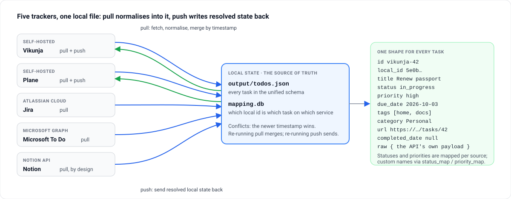

# todo-harvest

**Sync tasks between Vikunja, Plane, Jira, Microsoft To Do and Notion through one local state
file — pull from all five, push back to the two that take it.**

[](LICENSE)

[Website](https://mmdemirbas.github.io/todo-harvest/) ·
[Source](https://github.com/mmdemirbas/todo-harvest) ·
[Changelog](CHANGELOG.md) ·
[Project page](https://mdemirbas.com/en/projects/todo-harvest/)



Work is in Jira, the team board is in Plane, the family list is in Microsoft To Do, notes with
checkboxes are in Notion, and the self-hosted Vikunja was supposed to replace them all. It never
does. todo-harvest pulls every one into one file in one schema, resolves conflicts by
timestamp, and pushes the result back to the services that accept writes — no daemon, no
account, one command at a time.

- **One schema** — id, title, status, priority, dates, tags, category, url; the service's own
  payload kept under `raw`
- **Pull from five** — Vikunja, Plane, Jira, Microsoft To Do, Notion; **push to two** —
  Vikunja and Plane
- **Custom mappings** — `status_map`, `priority_map` and Notion `field_map` for instances with
  their own vocabulary
- **Explicit runs** — nothing polls; `pull`, `push` and `sync` do exactly what they say, and
  `inspect` and `export` never touch the network

## Quick start

```bash
git clone https://github.com/mmdemirbas/todo-harvest.git && cd todo-harvest
cp config.example.yaml config.yaml    # fill in the services you use
./ctl pull                            # everything into output/todos.json
./ctl push vikunja                    # local state back to Vikunja
./ctl sync                            # pull all, then push all
```

`./ctl` creates a virtual environment on first run and installs the dependencies. On Windows,
`harvest.ps1` takes the same arguments from PowerShell.

## Commands

| Command | Network | Does |
|---|---|---|
| `./ctl pull [source…]` | yes | Pull from every configured service, or the named ones, and merge |
| `./ctl push vikunja` / `plane` | yes | Push local state to one target |
| `./ctl sync` | yes | Pull all, then push all |
| `./ctl inspect projects [source]` | no | Project / list / database ids — for `default_project_id` |
| `./ctl inspect stats` | no | Task counts, field coverage, date ranges |
| `./ctl inspect fields jira` | no | The status, priority and tag values a source uses |
| `./ctl export [--output-dir DIR]` | no | Snapshot local state to JSON and CSV |
| `./ctl help [command]` | no | Grouped overview, or one command in detail |
| `./ctl test` | no | Tests with a coverage report |

## How it works

1. **Pull** fetches each configured service (REST, three retries with backoff), normalises every
   item into the unified schema, assigns a stable `local_id` in `mapping.db` on first sight,
   and merges: a newer `updated_date` replaces the local copy, an older one is ignored.
2. **Push** updates tasks that have a mapping on the target, creates the rest there when
   `default_project_id` is set, and records the new ids so the next pull recognises them.

Local state is the source of truth: a pull never overwrites a newer local edit, and a push
never invents a task on a service that has no mapping unless a default project is set.

### What lives where

| File | Holds | Commit it? |
|---|---|---|
| `config.yaml` | Tokens and per-service options | No — it is in `.gitignore`; `config.example.yaml` is the template |
| `output/todos.json` | Every task in the unified schema, the local source of truth | Your call; it is your task list |
| `mapping.db` | SQLite: local id ↔ service id per source | Keep it with `todos.json`; deleting it makes the next pull re-map everything |
| `output/*.csv`, `output/*.json` from export | Snapshots for spreadsheets or other tools | No |

## Setup

### config.yaml

All configuration lives in `config.yaml`. Copy `config.example.yaml` and fill in your credentials. Only configure the services you want to use — unconfigured ones are skipped.

```yaml
output:
  dir: ./output

mapping:
  db_path: ./mapping.db

vikunja:
  base_url: "http://localhost:3456"
  api_token: "YOUR_API_TOKEN"
  # default_project_id: 1      # required to push cross-source tasks into Vikunja

jira:
  base_url: "https://YOUR_SUBDOMAIN.atlassian.net"
  email: "your@email.com"
  api_token: "YOUR_API_TOKEN"
  # jql: "assignee = currentUser() ORDER BY created DESC"
  # status_map:
  #   "Custom Status": "in_progress"
  # priority_map:
  #   "Custom Priority": "high"

mstodo:
  client_id: "YOUR_CLIENT_ID"
  tenant_id: "consumers"

notion:
  token: "YOUR_INTEGRATION_SECRET"
  database_ids:
    - "DATABASE_ID_1"
  # field_map:
  #   status: "Status"
  #   priority: "Priority"
  #   due_date: "Due Date"
  #   tags: "Tags"
  #   category: "Epic"
  #   description: "Notes"
  # status_map:
  #   "Custom Status": "in_progress"
  # priority_map:
  #   "Custom Priority": "high"
```

### Custom mappings

Jira and Notion support config-driven mappings for status names, priority names, and (Notion only) column names. This is useful when your instance uses non-English or custom values.

**Jira:** `status_map` overrides the built-in status-category mapping. `priority_map` overrides priority name matching. `jql` customizes the search query (must be bounded — the default is `assignee = currentUser() ORDER BY created DESC`).

**Notion:** `field_map` maps your database column names to unified fields (`status`, `priority`, `due_date`, `tags`, `category`, `description`). Both `select` and `status` property types are supported. `status_map` and `priority_map` override the built-in value matching.

### Vikunja

1. Open your Vikunja instance (e.g., `http://localhost:3456`)
2. Go to Settings -> API Tokens
3. Create a new token with read/write permissions
4. Copy the token -> `config.yaml` -> `vikunja.api_token`
5. Set `vikunja.base_url` to your Vikunja instance URL

### Microsoft To Do

Requires an Azure AD / Entra ID tenant. If you don't have one, join the [M365 Developer Program](https://developer.microsoft.com/en-us/microsoft-365/dev-program) (free) or sign up for [Azure](https://azure.microsoft.com/free/).

1. Go to [Azure Portal - App registrations](https://portal.azure.com/#blade/Microsoft_AAD_RegisteredApps/ApplicationsListBlade)
2. Click **New registration**
3. Name: anything (e.g. "todo-harvest")
4. Supported account types: **Personal Microsoft accounts only**
5. Click **Register**
6. In the app's **Manifest** (left sidebar), set `"allowPublicClient": true` and save
7. Copy the **Application (client) ID** from the Overview page -> `config.yaml` -> `mstodo.client_id`
8. Set `tenant_id` to `"consumers"` (for personal Microsoft accounts)

On first run, the tool prints a device code and URL. Open the URL in your browser, enter the code, and sign in. The token is cached locally for subsequent runs.

### Jira

1. Log in to [Atlassian API token management](https://id.atlassian.com/manage-profile/security/api-tokens)
2. Click **Create API token**
3. Label: "todo-harvest" (or anything)
4. Click **Create** and copy the token -> `config.yaml` -> `jira.api_token`
5. Set `jira.email` to your Atlassian account email
6. Set `jira.base_url` to your Jira instance URL (e.g. `https://yourname.atlassian.net`)

### Plane

For self-hosted [Plane](https://plane.so) installations.

1. Log in to your Plane workspace
2. Go to **Workspace Settings** -> **API Tokens** -> **Add API Token**
3. Copy the token -> `config.yaml` -> `plane.api_token`
4. Set `plane.base_url` to your Plane instance URL (e.g. `https://plane.example.com`)
5. Set `plane.workspace_slug` to your workspace slug (from the URL after the domain)
6. To push cross-source tasks into Plane, set `plane.default_project_id` to a project UUID. See `./ctl inspect projects plane`.

### Notion

1. Go to [Notion Integrations](https://www.notion.so/my-integrations)
2. Click **New integration**
3. Name: "todo-harvest"
4. Select your workspace
5. Under **Capabilities**, ensure **Read content** is checked
6. Click **Submit**
7. Copy the **Internal Integration Secret** -> `config.yaml` -> `notion.token`
8. For each database you want to harvest:
   - Open the database in Notion
   - Click **Share** (top right) -> **Invite** -> select your "todo-harvest" integration
   - Copy the database ID from the URL: `notion.so/{workspace}/{DATABASE_ID}?v=...`
   - Add it to `config.yaml` -> `notion.database_ids`

## The unified schema

### Fields

Every task is normalized to a common format regardless of source:

| Field          | Type                | Description                              |
|----------------|---------------------|------------------------------------------|
| `id`           | string              | `{source}-{source_id}`                   |
| `local_id`     | string              | Stable UUID assigned on first pull        |
| `source`       | string              | `vikunja`, `mstodo`, `jira`, `notion`, or `plane` |
| `title`        | string              | Task title                               |
| `description`  | string or null      | Task description/body                    |
| `status`       | string              | `todo`, `in_progress`, `done`, `cancelled` |
| `priority`     | string              | `critical`, `high`, `medium`, `low`, `none` |
| `created_date` | ISO8601 or null     | Creation timestamp                       |
| `due_date`     | ISO8601 or null     | Due date                                 |
| `updated_date` | ISO8601 or null     | Last modification timestamp              |
| `completed_date` | ISO8601 or null   | When the task was marked done (MS To Do `completedDateTime`, Jira `resolutiondate`, Vikunja `done_at`; null for Notion) |
| `tags`         | list of strings     | Labels, categories, list names           |
| `url`          | string or null      | Link back to the original item           |
| `category`     | object              | Organizational container (see below)     |
| `raw`          | object              | Original API payload (all source fields) |

### Source-specific data in raw

The `raw` field preserves the complete API response for each task, including source-specific fields:

- **MS To Do:** `body` (notes), `checklistItems` (steps), `reminderDateTime`, `isReminderOn`, `completedDateTime`
- **Jira:** `description` (ADF), `comment`, `assignee`, `resolution`, `customfield_*`
- **Notion:** all database properties in their native types
- **Vikunja:** `description`, `labels`, `attachments`, `reminders`

### What pushes back

Legend: `rw` = pull and push wired; `pull` = pull only (push not implemented or not supported by this source).

| Field       | vikunja | jira | mstodo | notion | plane |
|-------------|---------|------|--------|--------|-------|
| title       | rw      | pull | pull   | pull   | rw    |
| description | rw      | pull | pull   | pull   | rw    |
| status      | rw      | pull | pull   | pull   | pull  |
| priority    | rw      | pull | pull   | pull   | rw    |
| due_date    | rw      | pull | pull   | pull   | rw    |
| tags/labels | rw      | pull | pull   | pull   | pull  |
| category    | rw      | pull | pull   | pull   | pull  |

Push is not yet implemented for Jira and Microsoft To Do (the CLI will raise an error if you try). Notion is pull-only by design. For Plane, push writes title, description, priority, and due date; status and labels are not synced.

## Troubleshooting

Almost every failure is a token or a permission; the tables below name the message and the fix.

### Microsoft To Do

| Error | Fix |
|-------|-----|
| "Failed to initiate device code flow" | Check that `client_id` is correct and `allowPublicClient` is `true` in the app manifest |
| "The client application must be marked as mobile" | Set `"allowPublicClient": true` in the app registration's Manifest |
| "Microsoft authentication failed" | Re-run the tool to get a new device code. Make sure you sign in within the time limit |
| "access forbidden" | Ensure your app registration has the `Tasks.Read` delegated permission |

### Jira

| Error | Fix |
|-------|-----|
| "authentication failed" | Verify `email` and `api_token` in config.yaml |
| "access forbidden" | Your API token may lack permissions |
| "Unbounded JQL queries" | Set `jql` in config.yaml (default: `assignee = currentUser()`) |

### Notion

| Error | Fix |
|-------|-----|
| "authentication failed" | Check your integration secret |
| "access forbidden" | The integration is not shared with the database |

### Vikunja

| Error | Fix |
|-------|-----|
| "authentication failed" | Check your API token in config.yaml |
| "access forbidden" | Check your token permissions |
| "tasks skipped: no Vikunja mapping found" | Set `default_project_id` under `vikunja:` in config.yaml — new tasks from other sources are created there |
| "Invalid model provided" on update | Ensure the task is a POST to `/api/v1/tasks/{numeric-id}` — an older bug stored prefixed IDs in mapping.db; `rm mapping.db` and re-pull fixes it |

Password reset:
```bash
docker compose exec vikunja /app/vikunja/vikunja user list
docker compose exec vikunja /app/vikunja/vikunja user reset-password 1 -d
```

### General

| Error | Fix |
|-------|-----|
| "Config file not found" | Copy `config.example.yaml` to `config.yaml` |
| "No command specified" | Use: `./ctl pull`, `./ctl push`, or `./ctl sync` |
| Network timeout | The tool retries up to 3 times with exponential backoff |

## Development

```bash
./ctl test                                                    # tests
.venv/bin/python -m pytest tests/test_normalizer.py -v        # one file
.venv/bin/python -m pytest --cov=src --cov-report=term-missing
```

Runtime: httpx, PyYAML, msal, rich. Development: pytest, pytest-cov, pytest-mock, respx.
See [CONTRIBUTING.md](CONTRIBUTING.md).

## License

[MIT](LICENSE)
